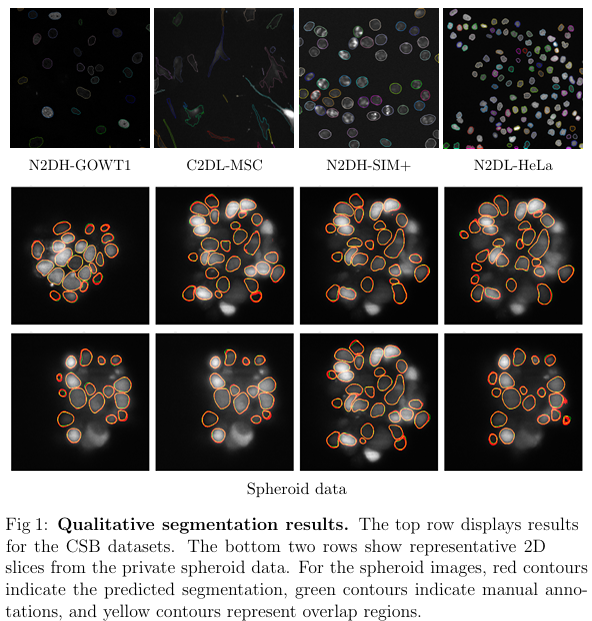
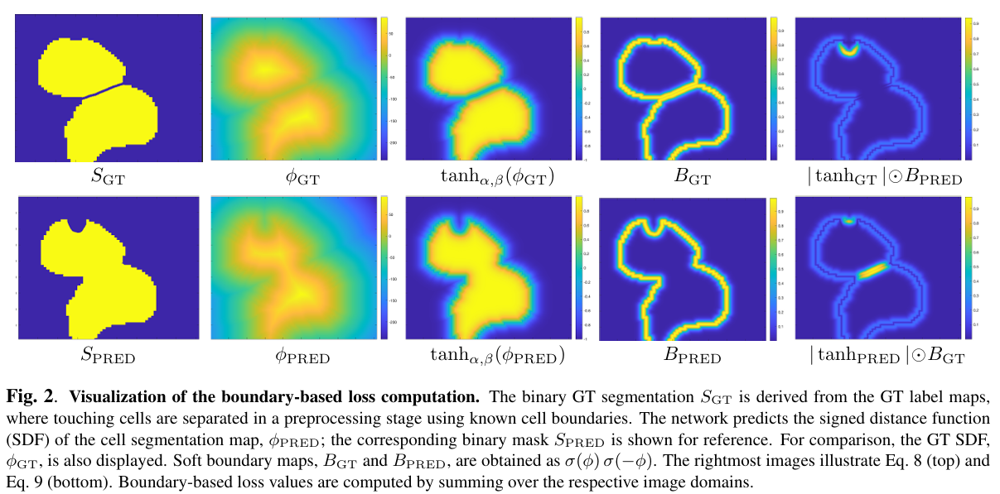

# Boundary-Aware Instance Segmentation

Official implementation of the paper: **"Boundary-Aware Instance Segmentation in Microscopy Imaging"**.

[](https://github.com/ThomasMendelson/BAISeg) 
[](https://opensource.org/licenses/MIT)

## 📌 Overview
Accurate delineation of individual cells in microscopy videos is essential for studying cellular dynamics, yet separating touching or overlapping instances remains a persistent challenge. We propose a prompt-free, boundary-aware instance segmentation framework that predicts **Signed Distance Functions (SDFs)** instead of binary masks.




### Key Features
* **SDF Modeling**: Enables smooth and geometry-consistent modeling of cell contours.
* **Learned Sigmoid Mapping**: A learned sigmoid converts SDFs into probability maps, yielding sharp boundary localization.
* **Unified MHD Loss**: Training is guided by a differentiable Modified Hausdorff Distance (MHD) loss that integrates region- and boundary-based terms.


## 🛠 Installation

### Requirements
The following dependencies are required (see `requirements.txt` for specific versions):
* Python 3.10+
* PyTorch 1.12.1 & TorchVision 0.13.1
* PyTorch Lightning 2.1.0
* MONAI 1.3.2
* TorchIO 0.19.7
* WandB (for logging)

### Setup
```bash
git clone [https://github.com/ThomasMendelson/BAISeg.git](https://github.com/ThomasMendelson/BAISeg.git)
cd BAISeg
pip install -r requirements.txt
```

## 🚀 Usage

### 1. Configuration
The model behavior is controlled via YAML configuration files (e.g., `unet2d.yml`). The configuration is divided into three main sections:

* **Data**: Define dataset paths, batch size, and augmentations.
* **Model**: Network architecture and loss weights (MHD, MSE, BCE).
* **Trainer**: Set training parameters such as maximum epochs, GPU devices, and precision.

You can modify any parameter in the YAML file to adapt the framework to different microscopy datasets or hardware setups.

### 2. Training
To start the training process using PyTorch Lightning:
```bash
python train_unet.py -c unet2d.yml
```
### 3. Inference / Testing
To evaluate a trained model and generate instance segmentation masks (16-bit TIFF format), use the command below. This will load the specified weights and process the images in the input directory.

```bash
python train_unet.py -c unet2d.yml \
                    -t \
                    -i /path/to/input_images \
                    -o /path/to/output_results \
                    -w /path/to/checkpoint.ckpt
```


## 🖋️ Citation
If you use this code or our paper in your research, please cite:
```bash
@inproceedings{mendelson2026boundary,
  title={Boundary-Aware Instance Segmentation in Microscopy Imaging},
  author={Mendelson, Thomas and Francois, Joshua and Lahav, Galit and Raviv, Tammy Riklin},
  booktitle={IEEE International Symposium on Biomedical Imaging (ISBI)},
  year={2026}
}
```
