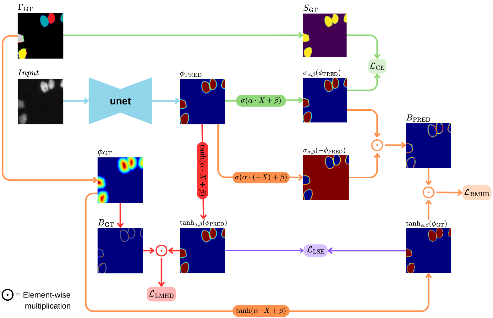
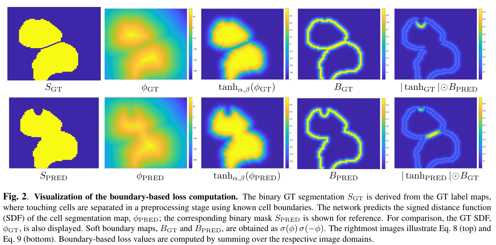

# Boundary-Aware Instance Segmentation

Official implementation of the paper: **"Boundary-Aware Instance Segmentation in Microscopy Imaging"**.

<p align="center">
  <a href="https://arxiv.org/abs/2603.21206" style="padding-left: 0.5rem;">
    
  </a>
  <a href="#" style="padding-left: 0.5rem;">
    
  </a>
  <!--
  <a href="YOUR_PROJECT_PAGE_LINK" style="padding-left: 0.5rem;">
    
  </a>
  -->
</p>
<p align="center">
  
</p>

## 📌 Overview
Accurate delineation of individual cells in microscopy images is essential for studying cellular dynamics, yet separating touching or overlapping instances remains a persistent challenge. We propose a prompt-free, boundary-aware instance segmentation framework that predicts **Signed Distance Functions (SDFs)** instead of binary masks. A learned sigmoid mapping converts the predicted SDF into probability maps and soft boundaries, while a differentiable **Modified Hausdorff Distance (MHD)**-based loss encourages accurate boundary alignment and improved separation of adjacent cells.

### Key Features
- **SDF-based representation** for smooth and geometry-consistent modeling of cell contours.
- **Learned sigmoid mapping** for converting SDF predictions into segmentation probabilities and soft boundaries.
- **Boundary-aware MHD loss** for directly encouraging separation between touching instances.
- **Prompt-free framework** that achieves competitive instance segmentation performance on microscopy datasets.

<p align="center">
  
</p>

The framework combines region-level and boundary-level supervision:
- **Cross-Entropy (CE)** on the learned sigmoid mapping of the predicted SDF
- **Least Squares Error (LSE)** on the predicted signed distance function
- **Left and Right Modified Hausdorff Distance (LMHD / RMHD)** terms for boundary alignment
<!--
## Qualitative Results

<p align="center">
  
</p>
-->

## 🛠 Installation
```bash
# Clone the repository
git clone https://github.com/ThomasMendelson/BAISeg.git
cd BAISeg

# Create a conda environment
conda create -n baiseg python=3.10
conda activate baiseg

# Install requirements
pip install -r requirements.txt
```

## 🚀 Usage

### 1. Configuration
The implementation uses PyTorch Lightning for modular design and YAML configuration files for experiment management.
The main configuration file (e.g., unet2d.yml) is divided into three sections:

* **Data**: Define dataset paths, batch size, and augmentations.
* **Model**: Network architecture and loss weights (MHD, MSE, BCE).
* **Trainer**: Set training parameters such as maximum epochs, GPU devices, and precision.

You can modify any parameter in the YAML file to adapt the framework to different microscopy datasets or hardware setups.

### 2. Training
To train the model:
```bash
python train_unet.py -c unet2d.yml
```
### 3. Inference / Testing
To evaluate a trained model and generate instance segmentation masks in 16-bit TIFF format:

```bash
python train_unet.py -c unet2d.yml \
                    -t \
                    -i /path/to/input_images \
                    -o /path/to/output_results \
                    -w /path/to/checkpoint.ckpt
```


## 🖋️ Citation

If you use this code or our paper in your research, please cite:

```bibtex
@article{mendelson2026boundary,
  title={Boundary-Aware Instance Segmentation in Microscopy Imaging},
  author={Mendelson, Thomas and Francois, Joshua and Lahav, Galit and Raviv, Tammy Riklin},
  journal={arXiv preprint arXiv:2603.21206},
  year={2026},
  note={Accepted for oral presentation at IEEE ISBI 2026}
}
```
